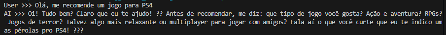
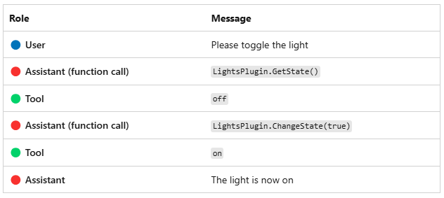

# PROJETO SEMANTIC KERNEL

O objetivo deste desafio é explorar o desenvolvimento de aplicações práticas utilizando o Azure OpenAI, incluindo chamadas de API e integração com o Semantic Kernel.

## FERRAMENTAS UTILIZADAS

* <a href="#criação-de-chat">Criação de chat</a>
* <a href="#assistente-luz">Assistente luz</a>
* <a href="#considerações-finais">Considerações finais</a>

 ## Criação de chat

Com base nas Aulas criei um assistente de chat de entende de games e sugere alguns jogos se baseando nas preferências do usuario.

~~~c#
using Azure.AI.OpenAI; 
using Azure;
using OpenAI.Chat;

string openAIEndpoint = "Endpoint";
string openAIAPIKey = "Chave";
string openAIDeploymentName = "Deployment";

var endpoint = new Uri(openAIEndpoint);
var credentials = new AzureKeyCredential(openAIAPIKey);

var openAIClient = new AzureOpenAIClient(endpoint, credentials);

var systemPrompt = """
You are a game enthusiast who helps people discover best games. You are nerd and friendly. 
You ask people what type of games they like to take and then suggest some.
""";
#pragma warning restore CS0219 // Variable is assigned but its value is never used

List<ChatMessage> chatHistory = new();
SystemChatMessage systemMessage = ChatMessage.CreateSystemMessage(systemPrompt);

chatHistory.Add(systemMessage);

string userGreeting =
"Olá, me recomende um jogo para PS4";

UserChatMessage userGreetingMessage = ChatMessage.CreateUserMessage(userGreeting);
chatHistory.Add(userGreetingMessage);

Console.WriteLine($"User >>> {userGreeting}");

var chatClient = openAIClient.GetChatClient(openAIDeploymentName);
var response = await chatClient.CompleteChatAsync(chatHistory);
Console.WriteLine($"AI >>> {response.Value.Content.Last().Text}");
~~~

## Assistente luz

Utilizando o Semantic Kernel foi criado um assistente responsavel por controlar os Status das luzes.

~~~c#

using Microsoft.Extensions.DependencyInjection;
using Microsoft.Extensions.Logging;
using Microsoft.SemanticKernel;
using Microsoft.SemanticKernel.ChatCompletion;
using Microsoft.SemanticKernel.Connectors.OpenAI;
using System.ComponentModel;
using System.Text.Json.Serialization;
using Microsoft.SemanticKernel;

var modelId = "";
var endpoint = "";
var apiKey = "";

var builder = Kernel.CreateBuilder().AddAzureOpenAIChatCompletion(modelId, endpoint, apiKey);

builder.Services.AddLogging(services => services.AddConsole().SetMinimumLevel(LogLevel.Trace));

Kernel kernel = builder.Build();
var chatCompletionService = kernel.GetRequiredService<IChatCompletionService>();

kernel.Plugins.AddFromType<LightsPlugin>("Lights");

OpenAIPromptExecutionSettings openAIPromptExecutionSettings = new() 
{
    FunctionChoiceBehavior = FunctionChoiceBehavior.Auto()
};

var history = new ChatHistory();

string? userInput;
do {
    
    Console.Write("User > ");
    userInput = Console.ReadLine();

    
    history.AddUserMessage(userInput);

   
    var result = await chatCompletionService.GetChatMessageContentAsync(
        history,
        executionSettings: openAIPromptExecutionSettings,
        kernel: kernel);

    
    Console.WriteLine("Assistant > " + result);

    
    history.AddMessage(result.Role, result.Content ?? string.Empty);
} while (userInput is not null);

public class LightsPlugin
{
   
   private readonly List<LightModel> lights = new()
   {
      new LightModel { Id = 1, Name = "Table Lamp", IsOn = false },
      new LightModel { Id = 2, Name = "Porch light", IsOn = false },
      new LightModel { Id = 3, Name = "Chandelier", IsOn = true }
   };

   [KernelFunction("get_lights")]
   [Description("Gets a list of lights and their current state")]
   public async Task<List<LightModel>> GetLightsAsync()
   {
      return lights;
   }

   [KernelFunction("change_state")]
   [Description("Changes the state of the light")]
   public async Task<LightModel?> ChangeStateAsync(int id, bool isOn)
   {
      var light = lights.FirstOrDefault(light => light.Id == id);

      if (light == null)
      {
         return null;
      }

 
      light.IsOn = isOn;

      return light;
   }
}

public class LightModel
{
   [JsonPropertyName("id")]
   public int Id { get; set; }

   [JsonPropertyName("name")]
   public string Name { get; set; }

   [JsonPropertyName("is_on")]
   public bool? IsOn { get; set; }
}
~~~

## Considerações finais
É possível incorporar ferramentas de IA utilizando a função Semantic Kernel de forma simples e objetiva!!